<p align="center">
  
</p>

# Cursor provider for OpenCode 2

Use the models available to your Cursor account from OpenCode 2, including
Cursor private models, live model variants, image input, streaming, and tool
continuation.

This is the V2 beta line. OpenCode 1 users remain supported by the `2.x`
release on npm's `latest` tag; the beta package also exposes the preserved
legacy adapter as `@otto-assistant/opencode-cursor-oauth/v1` for migration
testing.

## Status

- Plugin version: `3.0.0-beta.2`
- OpenCode channel: V2 beta
- Plugin API: pinned to the matching OpenCode beta build
- Package dist-tag after publication: `beta`

OpenCode 2 and its plugin API are still beta. Exact beta versions are pinned
because entrypoints, hooks, and catalog shapes may change between previews.

## Install

Once the beta package is published:

```jsonc
{
  "$schema": "https://opencode.ai/config.json",
  "plugins": ["@otto-assistant/opencode-cursor-oauth@beta"]
}
```

Restart OpenCode after changing an npm plugin version. The current pinned beta
CLI can list active plugins with `opencode2 plugin list`; package add/remove
commands are not available in this preview.

For development from this repository:

```bash
bun install --frozen-lockfile
bun run build
```

Add the built entrypoint to a V2 config:

```jsonc
{
  "$schema": "https://opencode.ai/config.json",
  "plugins": ["../dist/index.js"]
}
```

Relative plugin paths are resolved from the config file containing them.

## Connect Cursor

Start OpenCode 2, run `/connect`, and choose **Cursor** followed by
**Sign in with Cursor**. Open the displayed URL and approve access.

OpenCode owns credential storage and refresh. The plugin does not read or
write OpenCode credential files directly.

You need:

- An active Cursor account with model entitlement
- OpenCode 2 beta matching the plugin API version
- Bun for the plugin runtime
- Node.js 18 or newer for the bundled HTTP/2 workers

The Cursor desktop application and `cursor-agent` CLI are not required.

## Architecture

```text
OpenCode 2
  └─ V2 integration and catalog APIs
       └─ native LanguageModelV3 adapter
            └─ Node HTTP/2 bridge pool
                 └─ Cursor AgentService
```

OpenCode owns provider selection, credentials, permissions, persistence, and
tool execution. Each user turn starts a Cursor AgentService Run from OpenCode's
active transcript. If Cursor requests a tool, that Run remains alive only until
OpenCode returns the matching result; terminal responses discard it. Cursor
checkpoints are not retained, while private Composer models and native Cursor
rate limits remain available.

### Model routing

The catalog is discovered from the signed-in Cursor account. Every model and
variant carries an encoded internal selection header containing the exact
Cursor model ID, parameters, and routing mode. The native adapter validates
that header and maps it into Cursor's `RequestedModel`.

No hardcoded offline model catalog is advertised. After a connection changes,
the plugin refreshes discovery and asks OpenCode to reload the catalog.

### Lifecycle

The plugin starts a bounded HTTP/2 worker pool during V2 `setup()`. Disabling,
reloading, or shutting down the plugin stops:

- active AgentService Runs
- HTTP/2 bridge workers
- pending OAuth polling
- catalog event subscriptions

## Development

```bash
npm test
npm run test:v2
npm run typecheck
npm run build
npm run test:package
npm run test:v2-loader
```

Or run the complete deterministic gate:

```bash
npm run verify
```

`test:package` packs the exact built artifact, installs only its production
dependencies with lifecycle scripts disabled, imports it independently, and
loads that extracted package through the pinned `opencode2` beta.

## Debugging

Enable plugin logs:

```bash
OPENCODE_CURSOR_DEBUG=1 opencode2
```

Optional AgentService controls:

- `OPENCODE_CURSOR_NATIVE_TOOL_SETTLE_MS`
- `OPENCODE_CURSOR_PRE_OUTPUT_STALL_TIMEOUT_MS`
- `OPENCODE_CURSOR_POST_TOOL_PRE_OUTPUT_STALL_TIMEOUT_MS`
- `OPENCODE_CURSOR_STALL_TIMEOUT_MS`
- `OPENCODE_CURSOR_MAX_ACTIVE_RUNS`
- `OPENCODE_CURSOR_NATIVE_PARK_TTL_MS`
- `OPENCODE_CURSOR_DEFAULT_CONTEXT_WINDOW`
- `OPENCODE_CURSOR_DEFAULT_MAX_TOKENS`
- `OPENCODE_CURSOR_BRIDGE_POOL_MIN`
- `OPENCODE_CURSOR_BRIDGE_POOL_MAX`
- `OPENCODE_CURSOR_BRIDGE_POOL_DISABLED`

## Known beta constraints

- OpenCode V2 plugin contracts may change before stable 2.0.
- One Cursor integration currently resolves one active OpenCode credential.
- Real account acceptance consumes Cursor quota and is run separately from
  deterministic CI.
- Models without explicit Cursor context metadata use the configurable default
  context and output limits listed above.
- The plugin relies on Cursor's private API, which can change without notice.

## License

MIT
